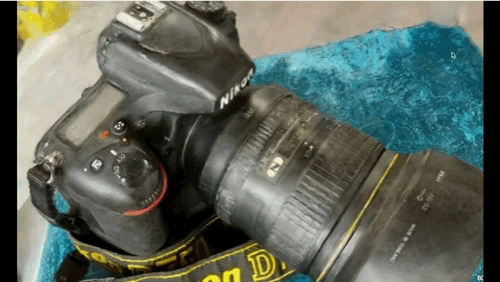
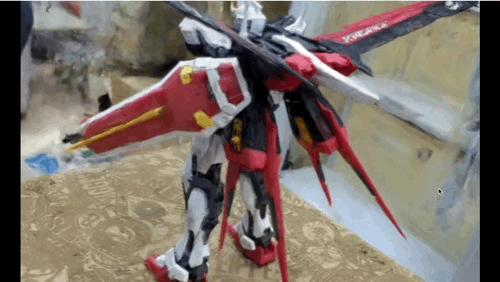
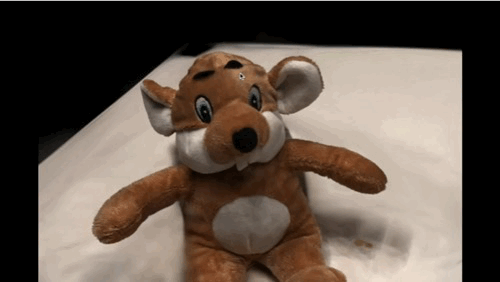
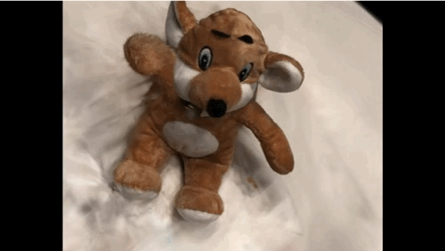
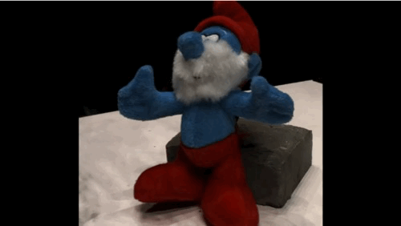
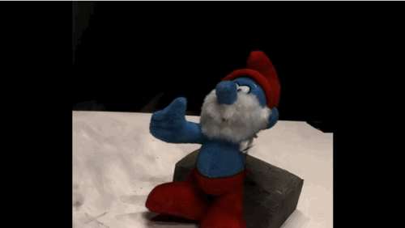

---
# Feel free to add content and custom Front Matter to this file.
# To modify the layout, see https://jekyllrb.com/docs/themes/#overriding-theme-defaults

layout: page
---

> Anonymous Website for NeurIPS 2024 Submission, "Skeleton Gaussians: Interpretable 3D Multi-view Reconstruction by Attention-guided Differentiable Primitives and Gaussians".

    

        

        
Camera

    

    

        

        
Gundam

    

    

        

            
                
            
            
                
            
        

        

            Marmot
            Waving
        

    

    

        

            
                
            
            
                
            
        

        

            Smurf
            Delete
        

    

